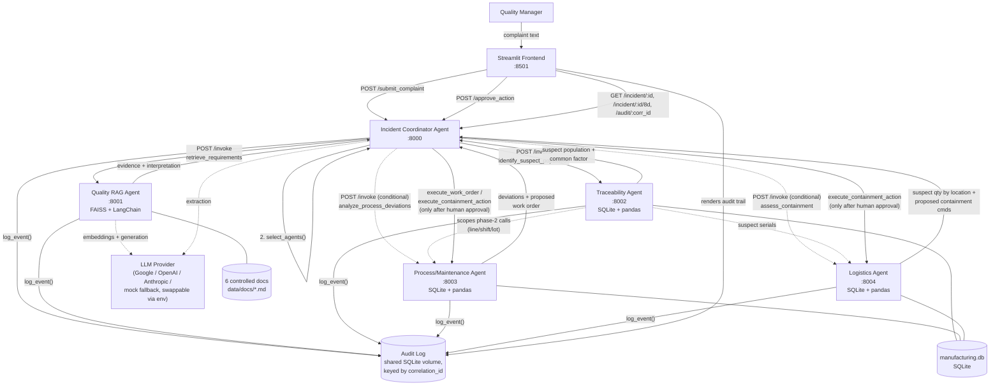

# Architecture

## System diagram

Solid arrows are always-executed calls; dashed arrows are conditional
(Process/Maintenance and Logistics are only dispatched when
`select_agents()` selects them) or auxiliary (LLM calls, data mounts).

## Agent responsibilities

- **Frontend (Streamlit, `:8501`)** — the only human-facing surface. Submits
  complaints, polls incident state, and is the sole place operational
  actions can be approved/rejected/modified. Never talks to any agent
  except the Coordinator.

- **Incident Coordinator Agent (FastAPI, `:8000`)** — the only orchestrator
  in the system, implemented as hand-written Python (no LangGraph/CrewAI/
  AutoGen): `extraction.py` (LLM-based structured extraction, with a
  rule-based fallback), `orchestration.py` (`select_agents()` +
  two-phase REST dispatch with timeout/retry), `consolidation.py` (merges
  raw agent responses into the four UI categories, detects cross-agent
  conflicts, builds the evidence-gap list and the merged proposed-action
  list), `eightd.py` (assembles the 8D draft purely from already-collected
  data). Holds all incident state in memory (`INCIDENTS: dict`) — see
  "Known Limitations" in the README.

- **Quality RAG Agent (FastAPI + FAISS, `:8001`)** — chunks and indexes the
  6 controlled documents at startup, serves `retrieve_requirements` with
  strict separation between raw retrieved evidence and LLM-generated
  interpretation, and explicitly declines (`no_evidence_found: true`) when
  nothing clears the relevance floor rather than asserting an unsupported
  answer.

- **Traceability and Production Agent (FastAPI + SQLite, `:8002`)** — maps
  an incident's date range to production serials, segments by
  line/shift/component lot/firmware, and returns a *reasoned* suspect
  population: the narrowest segment whose Marginal/Fail rate is
  disproportionately higher than the overall population, with the actual
  ratio and counts stated as the reasoning (not just a raw table dump).

- **Process and Maintenance Agent (FastAPI + SQLite, `:8003`)** — compares
  connector-insertion-force readings against the control-plan's 45–65N
  limit (the same constants documented in `data/docs/02_eps_control_plan.md`),
  cross-references alarms/calibration/maintenance logs for the flagged
  machine, and proposes a work order — held for approval, never
  auto-created.

- **Logistics and Containment Agent (FastAPI + SQLite, `:8004`)** — takes
  the Traceability agent's suspect serial list and computes affected
  quantities at the Tier-1 plant, in-transit, and delivered
  (OEM/third-party warehouse), proposing hold / shipment-block / 100%-sort
  commands — again held for approval, only flipped to `executed` after the
  Coordinator relays an explicit human decision.

## Data flow (two-phase orchestration)

The Coordinator's `run_workflow()` deliberately dispatches in two phases
rather than firing all four agents in parallel from the raw complaint:

1. **Phase 1 (always-on):** RAG and Traceability run first, against the
   incident's part number / symptom / date range.
2. **Phase 2 (conditional, scoped by Phase 1):** if selected, Process/
   Maintenance and Logistics are dispatched *using Traceability's suspect
   population* (line, shift, connector lot, serial numbers) as their scope
   — so Process/Maintenance checks control-plan deviations on the specific
   machine implicated by the suspect segment, and Logistics computes
   quantities for the specific suspect serials, instead of guessing at
   scope independently. This is the "merge results" step of the
   hand-written orchestration feeding forward into the next dispatch.

Findings are then consolidated into four categories (Retrieved
Requirement / Manufacturing-Data Finding / Agent Hypothesis /
Human-Approved Action), cross-agent conflicts are detected heuristically
(e.g. a historical 8D's firmware root cause vs. current data showing no
firmware correlation), and the merged proposed-action list is held for
human approval before anything is marked `executed`.

## Cross-cutting mechanisms

- **Correlation ID:** generated once per incident, passed on every
  `AgentMessage`/`AgentResponse` and every `log_event()` call.
- **Timeout + retry:** implemented once, in `shared/http_client.py::dispatch()`
  (5s timeout, 2 attempts), used by every Coordinator→agent call so the
  policy isn't duplicated per service.
- **Duplicate-message guard:** `shared/dedup.py::TaskDedupStore`, keyed by
  `task_id`, used by every agent (including the Coordinator's own
  `request_id`-keyed idempotency check on `/submit_complaint`).
- **Graceful degradation:** `dispatch()` never raises — on persistent
  failure it returns a synthetic `AgentResponse(status=unavailable)`, which
  the Coordinator surfaces as an explicit evidence gap rather than
  crashing or hanging. Verified manually: with `docker compose stop
  logistics-agent`, `POST /submit_complaint` still returns `200` (~18s,
  the two-attempt/5s-timeout dispatch penalty for the unreachable agent)
  with `agent_health["logistics-agent"].up == false` and
  `agent_responses["logistics-agent"].status == "unavailable"`, and the
  bundle still includes a consolidated result and a draft 8D built from
  the three agents that did respond.
- **Auth:** static `X-API-Key` header, one shared `verify_api_key` FastAPI
  dependency (`shared/auth.py`) reused by every service.
- **Audit log:** append-only SQLite table on a shared Docker volume
  (`shared/audit.py`), written by every service, queryable by
  `correlation_id` via the Coordinator's `/audit/{correlation_id}` and
  rendered in the frontend.
